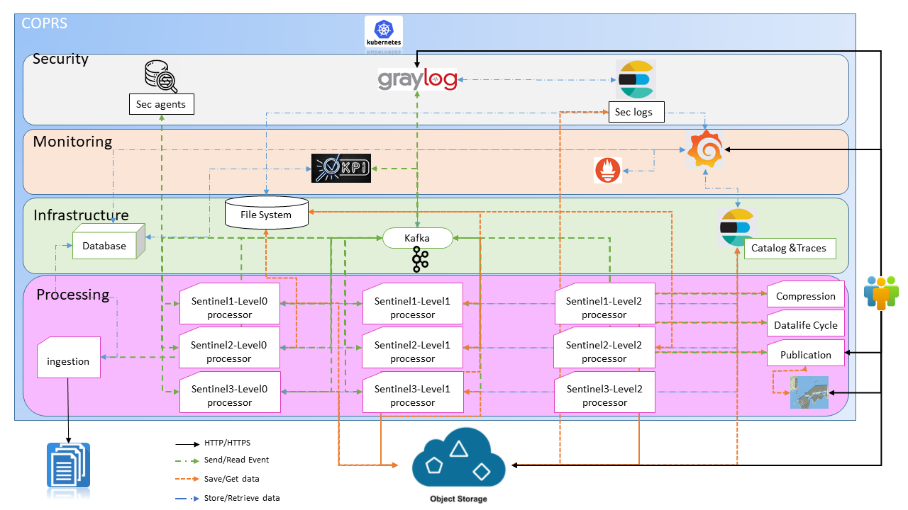
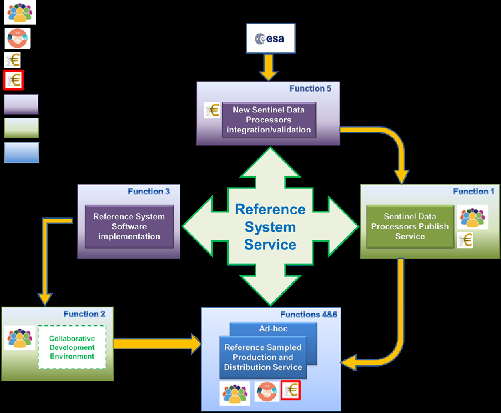
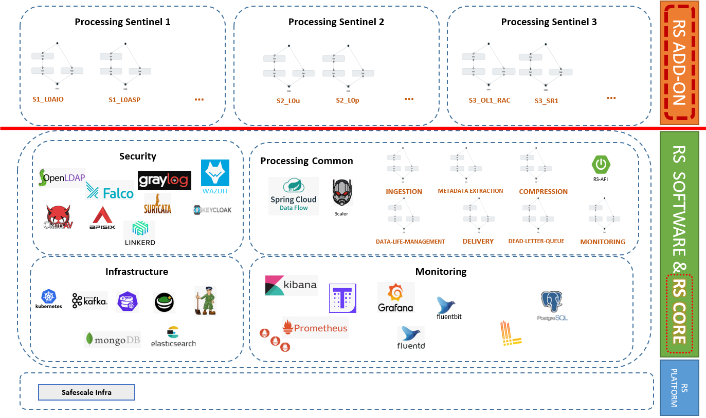
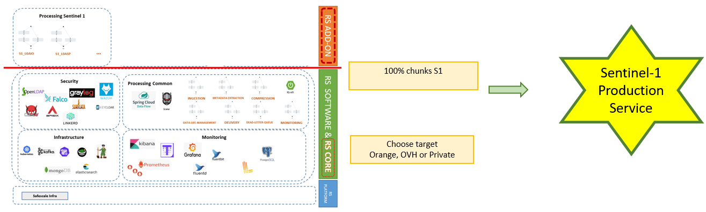
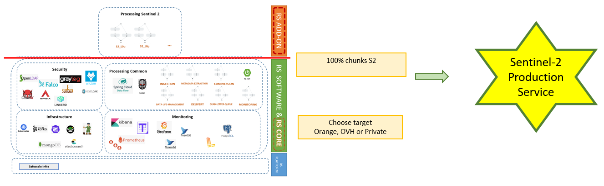
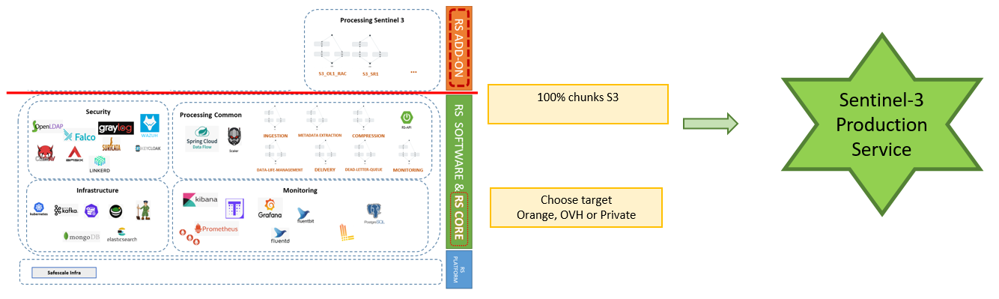

# **Reference System Design Document**

# Purpose of the document

The Reference System Design Document (DD) describes the overall architectural design of Reference System by describing layout infrastructure, monitoring, security and processing.

It is completed all along the software development lifecycle.

# Table Of Contents

- [Presentation of the system and its environment](#Presentation_of_the_system_and_its_environment)
- [Key design concept](#Key_design_concept)
- [Static breakdown of the system](#STATIC_BREAKDOWN_OF_THE_SYSTEM)
- [System dynamic](#SYSTEM_DYNAMIC)

# Presentation of the system and its environment

The Copernicus Reference System Service is the key component of the CSC Ground Segment. It provides an open source and versatile capacity to integrate and validate new Sentinel Data Processors and therefore to improve performances of the system.

This service environment brings a new mind-set in the development based on an open source community to reinforce the adoption and attractiveness of Sentinel data.

## Cloud native architecture

The system is based on a full Cloud native system so the solution can meet Copernicus unpredictable user scenarios while optimising costs. Sentinel-1 PDGS returns of experience is fully integrated in the design of the service.

Furthermore, the Reference System interfaces directly with a cloud orchestrator. Services are launched, duplicated and terminated in synergy with the underlying Cloud infrastructure so the complete system adapts quickly to the current system load or spontaneous failures.

This strategy prevents procuring a dedicated infrastructure and is in line with the global transformation of IT services relying on the maturity reached by Cloud Service Providers. Public clouds are naturally opened on the Internet and therefore well fitted for services with public access.

In addition, building a cloud agnostic solution allows one to take advantage of the fair competition between Cloud Service Providers and to be freed from the cloud provider's own priorities and strategies.

## Workflows as the core building primitive

Workflows allow breaking down complex problems into smaller, reusable pieces. With this simple definition, one can argue this technique is already used by the Consortium in previous Copernicus programs, such as Sentinel 1 PDGS: processors do collaborate to produce more and more advanced products as production progresses. Yet, they only exist implicitly in the system as the consequence of the configuration of the communication channels between processors.

In the Reference System requirements, workflows appear as interface elements, which users can browse, instantiate and monitor. The design promotes workflows as a key concept on top of which the rest of the system is built. We integrate Spring Cloud Data Flow, a cloud-native programming and operating model for composable data micro services, to develop our system as a collection of workflows, each orchestrating business specific micro services.

Since this concept is built into the orchestrator, the system exposes excellent progress information and error handling mechanisms out of the box. No need to reconstruct workflow states by correlating monitoring data from individual micro services. The operation, monitoring and maintenance of the system are therefore made easier. Less operators are required and using a parametric cost model allows to offer the right service for the right costs for the benefits of both the users and the Agency.

# Key design concept

## Micro-service architecture

1. **Focus on Services with One Task in Mind**
microservices are modular, composable and fine-grained units that do one thing and one thing only.
2. **Clean Separation of Stateless and Stateful Services**
There are broadly two types of micro-service : "stateless" and "stateful".
 We will privilege the  **stateless**  service. One of the key advantages of microservices is the ability to scale rapidly. Like other distributed computing architectures, microservices scale better when they are  **stateless**.
 But a microservices-based application may contain stateful services in the form of a relational database management.
3. **Use a Lightweight Messaging Protocol for communication**
Apache Kafka has been chosen.
4. **Maintain Independent Revisions and Build Environments**
Another benefit of microservices is the ability to code and maintain each service independently. Though each micro-service is part of a large, composite application, from a developer standpoint, it is important to treat each service as an independent unit of code. Each service needs to be versioned and maintained separately in the source code control system. This makes it possible to deploy newer versions of services without disrupting the application.
5. **Avoid Host affinity**
Each service can be launched on any available host in the cluster that meets the predefined requirements. These requirements are more aligned with the specifications, like the CPU type, storage type, region and availability zone, rather than the software configuration. Services should function independently of the host on which they are deployed.
6. **Do Not Share Libraries or SDKs**
The premise of microservices is based on autonomous and fine-grained units of code that do one thing and one thing only. This is closely aligned with the principle of "don't repeat yourself" (DRY), which states that every piece of knowledge must have a single, unambiguous, authoritative representation within a system.

Every service is a self-contained unit of OS, runtime, framework, third-party libraries and code. When one or more containers rely on the same library, it may be tempting to share the dependencies by centrally configuring them on the host. This model introduces complexities in the long run. It not only brings host affinity, but also breaks the CI/CD pipeline. Upgrading the library or SDK might end up breaking a service. Each service should be treated entirely independent of others.

In some scenarios, the commonly used libraries and SDKs can be moved to a dedicated service that can be managed independently, making the service immutable.

(source : [https://thenewstack.io/ten-commandments-microservices/](https://thenewstack.io/ten-commandments-microservices/))

## Asynchronous communication

Asynchronous micro-service integration enforces microservices autonomy.

In the publish-subscribe system, messages are persisted in a topic. Consumers can subscribe to one or more topics and consume all the messages in that topic. In the Publish-Subscribe system, message producers are called publishers and message consumers are called subscribers.
 
## Event driven

Event-driven architecture enables minimal coupling, which makes it a good option for modern, distributed application architectures.

Distributed systems have several advantages, for example resiliency and horizontal scalability. At the same time they introduce new challenges compared to classic monolithic systems related to the networking overhead between services. When breaking down monoliths into microservices, the goal is to minimise the dependencies between the services.

While in the optimal case strangled services are independent from the monoliths, in reality there are often still some dependencies.

There are many different ways how services can communicate: different protocols, synchronous & asynchronous, different serialisation technologies, etc. One of the most common and easiest ways to communicate between services are synchronous REST API invocations. However, when it comes to microservices based architectures, this technique is often considered an anti-pattern since the dependencies from monolithic architectures still exist and they are now even harder to manage in distributed systems.
Alternative event-driven architectures and asynchronous communications are very promising.

(source : [http://heidloff.net/article/event-driven-architectures-loosely-coupled-microservices/](http://heidloff.net/article/event-driven-architectures-loosely-coupled-microservices/))

## Kubernetes usage

The RS design solution will be based on Kubernetes for orchestration.

Kubernetes has been used for more than 10 years of development and use.

Good practises to implement :
- Use K8S latest version
- Use namespace
- Maintain small container images
- Set resource request and limit
- Use readinessProbe and livenessProbe
- Deploy RBAC for security
- Auto scale
- Monitor control plane components
- Adopt git-based workflow
- Watch for high disk usage
- Regular audit policy logs
- Write configuration file using YAML rather than JSON
- Group related objects into a single file whenever it makes sense
- Don't specify default values unnecessarily: simple, minimal configuration will make errors less likely.
- Use ReplicaSet and Deployment
- Create a Service before backend workload

(source [https://www.bmc.com/blogs/kubernetes-best-practices/](https://www.bmc.com/blogs/kubernetes-best-practices/) ,

[https://kubernetes.io/docs/concepts/configuration/overview/](https://kubernetes.io/docs/concepts/configuration/overview/))

## Layer isolation

Processing and monitoring chain shall be isolated. This came with a large fault tolerance.

If one of them does not work, it must not impact the other.

# STATIC BREAKDOWN OF THE SYSTEM

# SYSTEM DYNAMIC

## Deployment

### Sentinel 1

### Sentinel 2

### Sentinel 3

