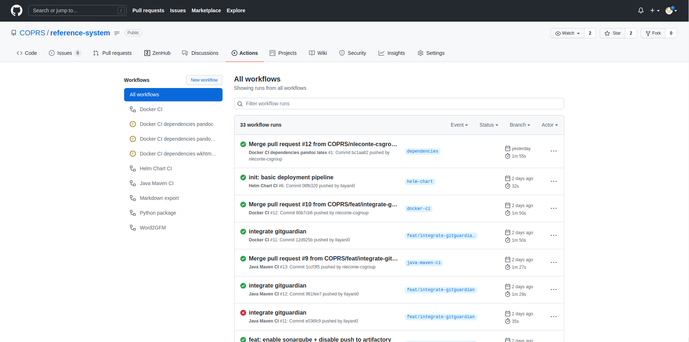

# Getting started using the GitHub CI 

## Create a repo 
Create a repo following [this tutorial](https://docs.github.com/en/get-started/quickstart/create-a-repo)

## Push your java maven project
Push your project on the repo. The project should look like [this one](https://github.com/mkyong/maven-examples/tree/master/maven-code-coverage)

## Enable the Gitub Action 
On the root of the repo, create a folder called `.github`. 
Inside this folder, create another folder called `workflows`

Inside the `workflows` folder, paste [this GitHub Action configuration](.github/workflows/java-maven-ci.yaml)
Then push your modifications

To understand the configuration file, you can refer to the [official documentation](https://github.com/features/actions)

## Check the state of the CI on the Action tab  
Click on the [Action tab](https://github.com/COPRS/reference-system/actions/workflows/java-maven-ci.yml) on the GitHub repository. 

The output should look like this:

Clicking on the most recent workflow will show you what happpened in this workflow, as well as the state of the workflow.

## Technical Points
Technicals explantations can be found on [this file](technical_points.md)

## Environement variable to define
  USERNAME: Username of the artifactory technical account 
  PASSWORD: His password, encrypted. 