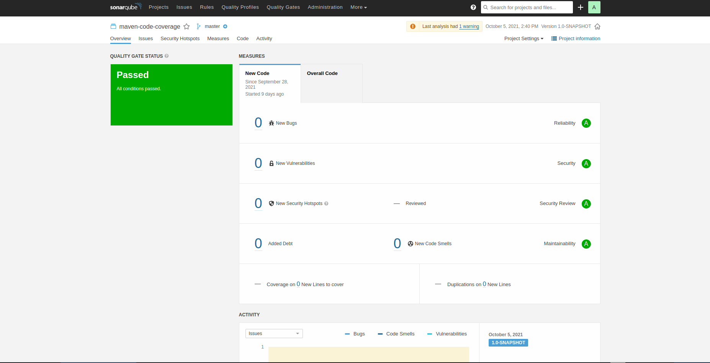
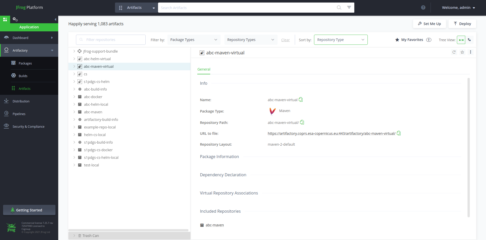
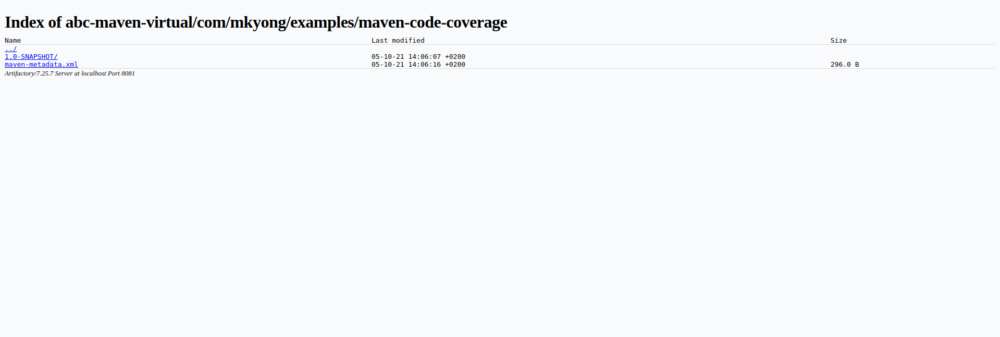

## Where to find the maven project? 
The maven projet is forked from [this source](https://github.com/mkyong/maven-examples/tree/master/maven-code-coverage)

## SonarQube
This pipeline eecute a SonarQube Scan to enshure three points: best practices in code are respected, security scan are passing and quality gates are respected. 
The SonarQube Server is accessible via [this link](https://sonarqube.coprs.esa-copernicus.eu). The credentials to access the GUI are team-based.

## Artifactory
Once the Jar is builded, it will be pushed on the Jforg Artifactory. 
The Artifactory Server is accessible via [this link](https://sonarqube.coprs.esa-copernicus.eu/projects). The credentials to access the GUI are team-based. 

### How to pull the JAR ? 
Access [the UI of the repo](https://artifactory.coprs.esa-copernicus.eu/ui/native/abc-maven-virtual/). Login to JFrog if necessary. 
Browse through the folders, find and download the preffered JAR. 
